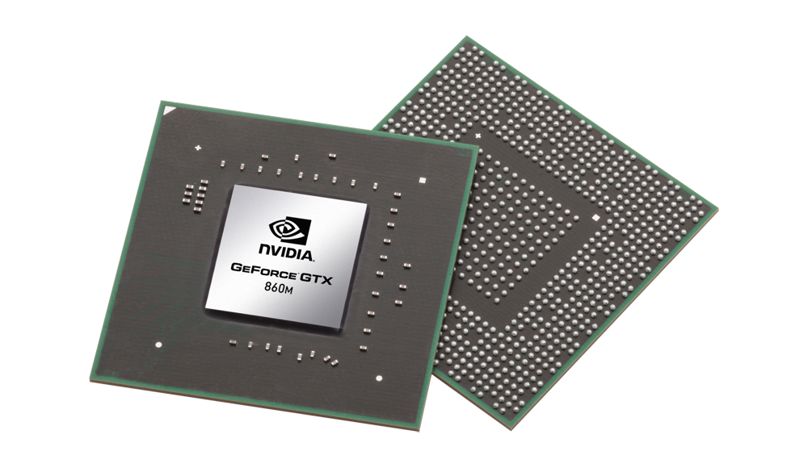
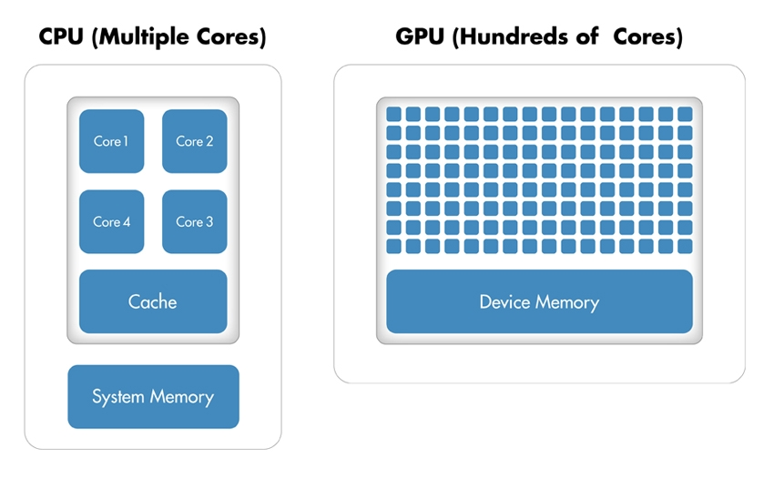

# tensorflow-cuda

It has been awhile since I wrote my first post and today I decided to write the next one. So here is the story, I was in Google HQ Dublin for GDG DevFest 2017 and one of the codelabs provided was on Tensorflow.

While poking around in the codelab for setting up the environment, one of the options is to use Tensorflow with GPUs, therefore I decided to use take advantage of my Nvidia graphic cards and give a try to the setup.

**Disclaimer** : This post is a collection of guidelines on how to setup NVIDIA drivers if you have a gaming laptop with Linux. You might need to change few steps based on what distribution you are running on.

### How is my setup:
* Distribution: **[Ubuntu 17.04](https://wiki.ubuntu.com/ZestyZapus/ReleaseNotes)**
* Laptop Model: **[Lenovo Y50-70](https://www.cnet.com/products/lenovo-y50-70-laptop-59440640-black-web-special-4th-generation-intel-core-i7-4720hq-2-60ghz-1600mhz-6mb/specs/)**
* Nvidia graphic card: **[GeForce GTX 860](https://www.geforce.com/hardware/notebook-gpus/geforce-gtx-860m/specifications)**

#### Let's get a first overview on why you would love to do this in the first place.

## **What is a GPU?** 

> ### "It is a specialized electronic circuit designed to rapidly manipulate and alter memory to accelerate the creation of images in a frame buffer intended for output to a display device."

## **Architecturally**:

* **CPU** is composed of just **few cores** with lots of cache memory that can handle a **few software threads** at a time.

* **GPU** is composed of **hundreds of cores** that can handle thousands of threads simultaneously.

 

## How GPUs accelerate software applications?

> GPU has a massively parallel architecture consisting of thousands of smaller, more efficient cores designed for handling multiple tasks simultaneously.

 

### What is CUDA 

> CUDA is a parallel computing platform and programming model that enables dramatic increases in computing performance by harnessing the power of the graphics processing unit (GPU).

**************************
# How to setup your gaming laptop with NVIDIA Graphic Cards to use Tensorflow.

## NVIDIA requirements to run TensorFlow with GPU support

### 1. CUDA® Toolkit 8.0.
For details, see NVIDIA's documentation. Ensure that you append the relevant Cuda pathnames to the LD_LIBRARY_PATH environment variable as described in the NVIDIA documentation.

- In order to get the CUDA Toolkit, first verify if you have a CUDA capable GPU

  `lspci | grep -i nvidia`

Note: if this step does not display any output, go and check the following in the BIOS and also lookup your graphic card in the list of cuda drivers provided by NVIDIA.

- Verify you have a supported version of linux

`uname -m && cat /etc/*release`

And crosscheck against the table at the very beggining of the documentation.

- Verify you have your gcc installed.

`gcc --version`

**Note**: If you run into problems when running tensorflow due to gcc checkout: [gcc problems with cuda nvcc ](https://stackoverflow.com/questions/6622454/cuda-incompatible-with-my-gcc-version)

- Verify your system has the correct Kernel and headers installed.

First check the kernel version

`uname -r`

Then, install the headers for the current version of the kernel you are running on:

`sudo apt-get install linux-headers-$(uname -r)`

- Finally install CUDA and CUDA Toolkit.

`sudo apt install cuda-8-0`

** Note** : **Do Not** install latest version cuda-9-0, as October 2017, CUDA 9.0 is not supported by tensorflow yet.

- Install And the NVIDIA drivers compatible with your graphic card.

`sudo apt install nvidia-367`

**Note**: Again try not to install the latest version as it might not be supported by your graphic card.

### Post installation actions ###

* Setup your environment variables.

  `export PATH=/usr/local/cuda-8.0/bin${PATH:+:${PATH}}`

If you use the runfile method, additionally export the following, depending if you are:
  * Running on **64 bit**

  `export LD_LIBRARY_PATH=/usr/local/cuda-8.0/lib64${LD_LIBRARY_PATH:+:${LD_LIBRARY_PATH}}`

  * Running on **32 bit**

  `export LD_LIBRARY_PATH=/usr/local/cuda-8.0/lib${LD_LIBRARY_PATH:+:${LD_LIBRARY_PATH}}`

Now verify your cuda samples are correctly installed once you have installed the toolkit.

`ls /usr/local/cuda-8.0/samples`

## Verify your installation.
 

- Verify the driver version, by checking in the proc.

  `cat /proc/driver/nvidia/version`

- Check the version of the toolkit you are running by checking with nvcc, which is the CUDA compiler driver.

  
 `nvcc -v`
> The compilation trajectory involves several splitting, compilation, preprocessing, and merging steps for each CUDA source file. It is the purpose of nvcc, the CUDA compiler driver, to hide the intricate details of CUDA compilation from developers

- As the purpose of demonstration, lets compile one of the samples, DeviceQuery will give us all properties of the CUDA devices present in the system. Let's compile the sample:

  - Enter to the folder where the sample is located
     
  `cd /usr/local/cuda-8.0/samples/1_Utilities/deviceQuery`
   

  - compile the sample
     
    `sudo make`
  - Execute the deviceQuery tool.
   
  `./deviceQuery`

**Note**: If you get an error like this:

> unsupported GNU version! gcc versions later than 5 are not supported!

You can solved by creating a symbolik link from a previous version of gcc to your cuda binaries.

`sudo ln -s /usr/bin/gcc-4.9 /usr/local/cuda/bin/gcc`

`sudo ln -s /usr/bin/g++-4.9 /usr/local/cuda/bin/g++`

### 2. The NVIDIA drivers associated with CUDA Toolkit 8.0.

### 3. The NVIDIA CUDA® Deep Neural Network library (cuDNN) is a GPU-accelerated library of primitives for deep neural networks. cuDNN v6.0.

- Install the Runtime Library:  
  `sudo dpkg -i libcudnn7_7.0.4.31-1+cuda8.0_amd64.deb`
- Install Developer Library:  
`sudo dpkg -i libcudnn7-dev_7.0.4.31-1+cuda8.0_amd64.deb`
- Install docs and samples:  
`sudo dpkg -i libcudnn7-doc_7.0.4.31-1+cuda8.0_amd64.deb
`

**Note**: By the time I was installing cuDNN 7.0 was not compatible with TensorFlow. As today it appears there is a new release supporting cuda 8.0

## Verify your installation

 - Copy your samples to a writable path.  
 `cp -r /usr/src/cudnn_samples_v7/ $HOME`
 - Enter to the wrtitable path for compiling an specific sample.  
 `cd cudnn_samples_v7/mnistCUDNN/`
 - Compile your sample  
 `make clean && make`
 - Execute  
 `sudo ./mnistCUDNN`

### 3. GPU card with CUDA Compute Capability 3.0 or higher. See NVIDIA documentation for a list of supported GPU cards.

### 4. The libcupti-dev library, which is the NVIDIA CUDA Profile Tools Interface. This library provides advanced profiling support.

`sudo apt-get install libcupti-dev`

****************
## Now Finally, Install Tensorflow and start running your ML models.

1.First you should decide how you will install TensorFlow, as there is multiple options:  

  - Docker
  - Virtualenv ( My option )
  - Native pip
  - Anaconda
 

2. Installing Tensorflow with Virtualenv on Python3  

sudo apt-get install python3-pip python3-dev python-virtualenv
